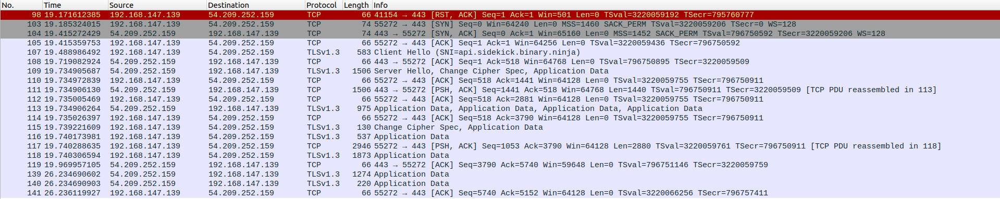

# Investigating how Sidekick Chat Assitant works in the backend  
## Preliminary investigation using WireShark


This is the output from Wireshark after intercepting Network Traffic from binary ninja ELF application.    

### Analysis of Packet Log    
packet 98: RST,ACK to end TCP connection (flaged red bcos there is no existing connection)  
packet 103-105: TCP 3 way handshake sequence btwn client and api server  
packet 107-109: TLS Handshake, 109 contains encryption setup  
packet 110-118: Application data exchange  
packet 119-141: Keep alive + Application data  

### Conclusion and findings  
Need to use MITM proxy to decrypt packets (burp suite) + Set custom CA cert so that TLS encryption can be decrypted.  

## Setting up MITM
### Install Burp Suite
Download Burp Suite:
``` 
https://portswigger.net/burp/releases/professional-community-2024-9-5?requestededition=community&requestedplatform=
```
Run Burp Suite installer:
```
# allow permissions to run this shell script  
chmod +x burpsuite_community_linux_v2024_9_5.sh  
# Run install shell script  
./burpsuite_community_linux_v2024_9_5.sh
```
### Configuring Burp Suite  
Navigate to `Proxy` --> `Proxy Settings`
Under `Proxy listeners`, check that there is a port listening for traffic.  
You should see `127.0.0.1:8080` by default, indicating Burp Suite is listening to traffic passing through port 8080 on local device.  
Click `Edit` on this port  
Under `Request Handling`, enable `Support invisible proxying`
Click `Ok` to save
### Install proxychains
We need proxychains to forward the network traffic from Binja to port 8080 so that Burp Suite can capture the traffic  
Install proxychains:  
```
sudo apt install proxychains
```
Configure proxychains to forward traffic to port 8080:
```
cd /etc/  
sudo nano proxychains.conf
```
1. Comment out `proxy_dns`
2. Ensure `dynamic_chain` and `random_chain` are commented out, `strict_chain` is **NOT** commented out
3. At the bottom of the file, append `http 127.0.0.1 8080`  
Check that your proxychains.conf file is same as the one i have updloaded.  
Write and Exit  


