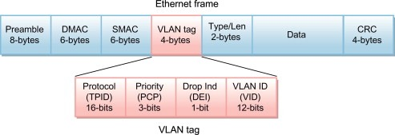

# nftables buffer overflow vulnerability (CVE-2023-0179)

## Contents
1. [Literature and Resources](#project-literature-and-research-resources)
2. [Tasks](#tasks)
3. [Emulating kernel](#emulating-vulnerable-kernel-using-qemu)  
3.1 [Obtaining vulnerable kernel version](#1-download-the-vulnerable-kernel-version)  
3.2 [Install QEMU](#2-install-qemu)  
3.3 [Build kernel](#3-build-kernel)  
3.4 [Create image for kernel](#4-create-image-for-kernel)  
3.5 [Run the kernel](#5-run-the-kernel)  
3.6 [Login to QEMU terminal](#6-login-to-qemu-terminal)

## Project literature and research resources: 
CVE report thread:  
```
https://groups.google.com/g/syzkaller/c/YRNDJBsJn_s?pli=1
```
CVE description and mitigation:
```
https://access.redhat.com/security/cve/cve-2023-0179
```
Exploit script:
```
https://github.com/TurtleARM/CVE-2023-0179-PoC
```
Explanation:
```
https://ethicalhacking.uk/cve-2023-0179-a-buffer-overflow-vulnerability-in-the-linux-kernel/#gsc.tab=0
```

### Tasks:

1. Understand the vulnerability from the write-up. It's quite detailed. Take note of which versions are vulnerable.

2. Find a kernel to study, uncompress it, load it in Binary Ninja

3. Find the vulnerable function(s). I don't know if there are function names. If there are, great. If not, you can try https://github.com/marin-m/vmlinux-to-elf

4. Verify whether the vulnerability is there or not

5. Repeat to analyse one vulnerable and one not vulnerable version.

6. Test 10 functions in disassembled kernel using sidekick renaming functiona nd log the outputs. Verify if the renamed output is accurate and rate the usefulness of the output.

## Emulating vulnerable kernel using QEMU:
### 1. Download the vulnerable kernel version  
Clone from git:  
```
git clone --depth 1 --branch v6.2-rc1 https://git.kernel.org/pub/scm/linux/kernel/git/torvalds/linux.git linux-6.2-rc1

```
### 2. Install QEMU
```
sudo apt-get update
sudo apt-get install git fakeroot build-essential ncurses-dev xz-utils libssl-dev bc flex libelf-dev bison qemu-system-x86
```
### 3. Build kernel
Build and compile the kernel from source that we obtained in step 1.  
``` 
# Enter the kernel source folder
cd linux-6.2-rc1
# From inside the linux-6.2-rc1 folder, make a .config file
make defconfig
```
Check if the make worked using `cat .config | grep KVM` command.  
You should see something like:
```
CONFIG_KVM_GUEST=y
CONFIG_HAVE_KVM=y
# CONFIG_KVM is not set
CONFIG_PTP_1588_CLOCK_KVM=y
```
Add some debug configurations to the Kernel, KASAN, debug symbols, etc.  
Open `.config` and append the code below to the bottom of the `.config` file.
```
# Coverage collection.
CONFIG_KCOV=y

# Debug info for symbolization.
CONFIG_DEBUG_INFO=y

# Memory bug detector
CONFIG_KASAN=y
CONFIG_KASAN_INLINE=y

# Required for Debian Stretch
CONFIG_CONFIGFS_FS=y
CONFIG_SECURITYFS=y
```
Regenerate the configurations with the necessary modifications.
```
make olddefconfig
```
Now we are ready to build the kernel, this process might take awhile.
```
make -j`nproc`
```
If the build was successful, you should see a `bzImage` file created in `arch/x86_64/boot` folder.  inux-6.2-rc1o boot into.  
### 4. Create image for kernel
The kernel needs a filesystem to boot into.
I created a Debain-like environment by following [this online guide](https://vccolombo.github.io/cybersecurity/linux-kernel-qemu-setup/#creating-an-image-for-the-kernel:~:text=Creating%20an%20image,Permalink)  
Use the following script, it will take awhile.
```
# In the linux-6.2-rc1 folder
sudo apt-get install debootstrap
mkdir image && cd image
wget https://raw.githubusercontent.com/google/syzkaller/master/tools/create-image.sh -O create-image.sh
chmod +x create-image.sh
./create-image.sh
```
If the image creation process was successful, in `linux-6.2-rc1/image` folder, you should see `bullseye.img`, which is your file system.  
### 5. Run the kernel
Create a `run.sh` shell script file in `linux-6.2-rc1` folder with your favorite text editor.  
In the run.sh file paste the following code:
```
qemu-system-x86_64 \
        -m 2G \
        -smp 2 \
        -kernel $1/arch/x86/boot/bzImage \
        -append "console=ttyS0 root=/dev/sda earlyprintk=serial net.ifnames=0 nokaslr" \
        -drive file=$2/bullseye.img,format=raw \
        -net user,host=10.0.2.10,hostfwd=tcp:127.0.0.1:10021-:22 \
        -net nic,model=e1000 \
        -enable-kvm \
        -nographic \
        -pidfile vm.pid \
        2>&1 | tee vm.log
```
Save and exit `run.sh` file.
Run the `run.sh` script:
```
chmod +x run.sh
./run.sh . image/
```
### 6. Login to QEMU terminal
The login is `root`.  
There is no password.
## Creating user account environment for PoC
After logging in as root to emulated terminal on QEMU, we need to create a user account with no privileges to test if the exploit actually works.
### Create new user account
**While logged in as root:**
```
# Creates a user account called normal user
# -m flag ensures user's home directory is created
adduser -m normaluser
```
### Install build essentials
**While logged in as root:**
```
apt install build-essential
```
### Install git
**While looged in as root:**
```
apt install git
```
### Grant permissions to normaluser
As `normaluser` still doesn't have any permissiosn, even in its own home directory, we need to grant it the permissions using root account, else we will not be able to write or execute any files while in `normaluser`.  
**While logged in as root:**  
1. First we need to navigate to `normaluser` home directory (if you r not already there)
```
cd ..
ls
```
Expected output:
```
bin   dev  home  lib32	libx32	    media  opt	 root  sbin  sys  usr
boot  etc  lib	 lib64	lost+found  mnt    proc  run   srv   tmp  var
```
2. Navigate into `home` directory
```
cd home
ls
```
EXpected output:
```
normaluser
```
3. Navigate into `normaluser` directory and check the permissions for that directory.
```
cd normaluser
```
4. Grant `normaluser` permissions over their home directory
```
chown normaluser:normaluser .
```
5. Check if `normaluser` has permissions
```
ls -ld
```
Expected output:  
You should see `normaluser` has `rwx` permissions in this directory
```
drwxr-xr-x. 3 normaluser normaluser 4096 Nov 20 08:42 .
```
### Clone exploit script
We need to clone the exploit script while logged in as `normaluser`.
1. Change user to `normaluser` from root
```
su normaluser
```
2. Clone [this repository](https://github.com/TurtleARM/CVE-2023-0179-PoC.git)
```
git clone https://github.com/TurtleARM/CVE-2023-0179-PoC.git
ls
```
If you have set everything up properly previously, you should be able to git clone the repo successfully.  
Expected output:
```
CVE-2023-0179-PoC
```
### Build the exploit
Following the guide from the [exploit repo](https://github.com/TurtleARM/CVE-2023-0179-PoC.git), we need to install some packages first.  
For that we need to log back into `root` so that we have privileges to install system wide libraries.
1. Log back into `root`
```
su
```
2. Install packages
```
apt-get install libmnl-dev libnftnl-dev
```
Now We can build the needle file as `normaluser`.
3. Log back into `normaluser`
```
su normaluser
```
4. Build needle
```
cd CVE-2023-0179-PoC
make needle
```
5. If the build succeeded you should see an ELF file called `needle`
```
file needle
```
Expected output:
```
needle: ELF 64-bit LSB pie executable, x86-64, version 1 (SYSV), dynamically linked, interpreter /lib64/ld-linux-x86-64.so.2, BuildID[sha1]=adde9d9702edb1612e352953a8477e16b52f93bd, for GNU/Linux 3.2.0, not strd
```


## Understanding the vulnerability
### Introduction
**Type**: Buffer overflow  
**Location**: Netfilter subsystem in linux kernel  
**Exploit details**: Overflow the buffer that stores VLAN headers in Netfilter subsystem.
**Consequence**: Allow local attacker to gain root privileges on affected system.
### VLAN header: 
**Description**: A header added to an Ethernet frame.  
**Purpose**: Identify the VLAN that the frame belongs to, ensure segmentation of network.  
**Structure**:  
  
  
4 bytes (32 bits) inserted into Ethernet frame between source MAC address & EtherType/length field.  
Contains the following fields:  
1. **Tag Protocol Identfier (TPID)** 16 bits:  
        - Always set to `0x8100` to indicate that the frame carries VLAN information.
2. **Priority Code Point (PCP)** 3 bits:  
        - Used to prioritize traffic (value range 0~7)
3. **Drop Eligible Indicator (DEI)** 1 bit:  
        - Inicates if the frame can be dropped in case of network congestion
4. **VLAN ID** 12 bits:  
        - Identifies which VLAN this frame belongs to.  
        - 4096 (2<sup>12</sup>) possible VLAN IDs.


