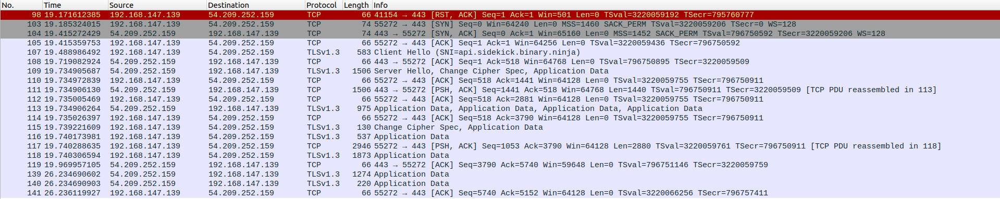

# Investigating how Sidekick Chat Assitant works in the backend  
## Preliminary investigation using WireShark


This is the output from Wireshark after intercepting Network Traffic from binary ninja ELF application.    

### Analysis of Packet Log    
packet 98: RST,ACK to end TCP connection (flaged red bcos there is no existing connection)  
packet 103-105: TCP 3 way handshake sequence btwn client and api server  
packet 107-109: TLS Handshake, 109 contains encryption setup  
packet 110-118: Application data exchange  
packet 119-141: Keep alive + Application data  

### Conclusion and findings  
Need to use MITM proxy to decrypt packets (burp suite) + Set custom CA cert so that TLS encryption can be decrypted.  

## Setting up Burp Suite
Download Burp Suite:
``` 
https://portswigger.net/burp/releases/professional-community-2024-9-5?requestededition=community&requestedplatform=
```
Run Burp Suite installer:
```
# allow permissions to run this shell script  
chmod +x burpsuite_community_linux_v2024_9_5.sh  
./burpsuite_community_linux_v2024_9_5.sh
```


